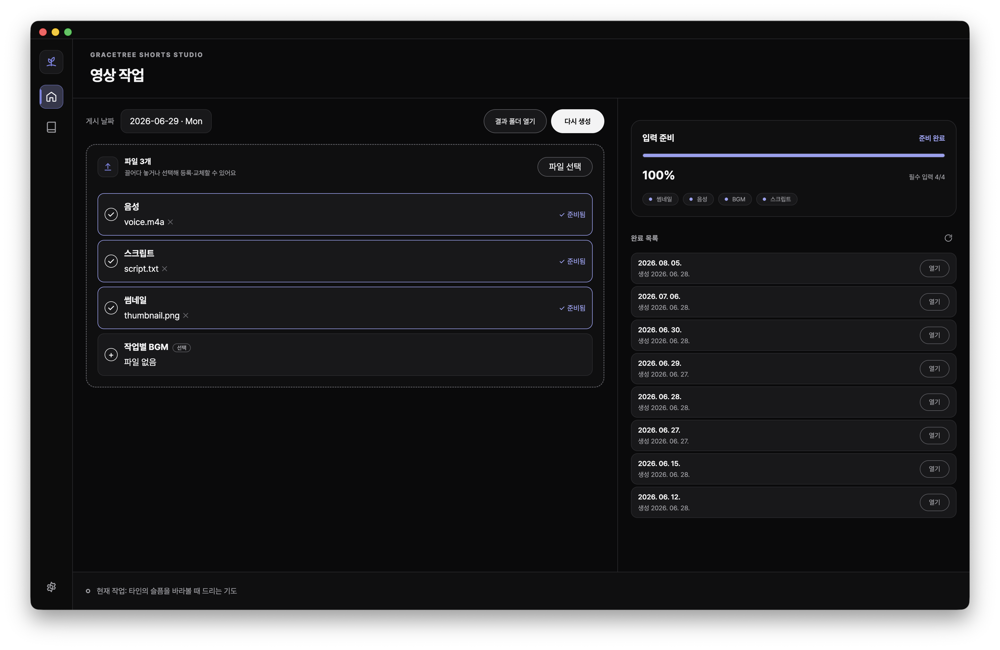
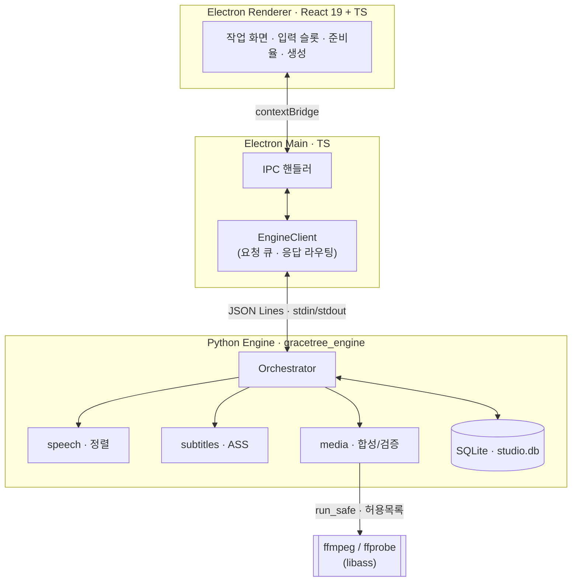

<div align="center">

# 🌱 GraceTree Shorts Studio

**말씀기도 쇼츠를 로컬에서, 오프라인으로, 반복 가능하게 자동 제작하는 데스크톱 앱**

_A fully-offline desktop studio that turns a voice recording + script into a finished vertical short — local speech alignment, styled subtitle burn-in, and an atomic, recoverable render pipeline._

<br/>


</div>

🌐 [Website](https://slur16105.github.io/gracetree-shorts-studio/) · ⬇️ [Download](https://github.com/slur16105/gracetree-shorts-studio/releases)

---

## 한눈에

매주 같은 포맷의 말씀기도 쇼츠를 손으로 편집하던 작업을, **음성 + 스크립트만 넣으면 완성 영상이 나오도록** 자동화한 로컬 데스크톱 도구다. 영상 편집기가 아니라 *"오늘 생성 가능한 상태인가, 방금 만든 결과가 어디 있는가"* 를 빠르게 끝내는 반복 제작 도구를 지향한다.

- **완전 오프라인** — 음성 인식(STT)까지 로컬 모델로 처리한다. 네트워크 호출이 없어, 원고·음성 같은 민감한 콘텐츠가 기기를 떠나지 않는다.
- **멀티프로세스 아키텍처** — Electron(TypeScript) UI ↔ Python 엔진을 **JSON Lines 프로토콜 + 공유 JSON Schema 계약**으로 안전하게 연결한다.
- **프로덕션급 안전 설계** — 허용목록 기반 서브프로세스, 경로 경계 검사, 원자적 커밋, 취소·실패 복구를 1차 안전선으로 둔다.
- **크로스플랫폼** — Windows / macOS 설치 패키지, 코드 서명 게이트, 오프라인 설치 스모크 테스트 포함.

<p align="center">
  
</p>

---

## ✨ 주요 기능

| 영역 | 기능 |
|------|------|
| **입력** | 드래그앤드롭/파일선택 일괄 등록, 파일명 기반 **자동 역할 분류**(음성·BGM·스크립트·썸네일), 충돌·미분류 슬롯 관리 |
| **스크립트** | `[제목] · [말씀] · [기도]` 구역 파싱과 실시간 유효성 검증 |
| **음성 정렬** | 로컬 Whisper로 **단어 단위 타임스탬프** 추출 → 자막 블록을 실제 발화 구간에 정렬 |
| **자막** | 스타일드 ASS 생성 + **libass 번인**(한글 폰트 번들), 제목/말씀/기도 레이아웃·페이드·"아멘" 홀드 |
| **합성** | 배경 영상 구성 → 오디오·썸네일 합성 → 1080×1920 / 30fps 세로 영상 렌더 |
| **신뢰성** | 게시 날짜별 작업 관리, 실행 중 **안전한 취소**, 실패 진단·복구 안내, 완료 결과 보호 + 원자적 재생성 |
| **배포** | Windows·macOS 설치 패키지, Python 엔진 번들(PyInstaller), 서명 게이트, 7일 반복 안정성 검증 |

---

## 🏗️ 아키텍처



- **계약 우선(contract-first)**: `packages/contracts/`의 JSON Schema가 단일 소스. Python은 `jsonschema`, TS는 AJV로 **양쪽에서 동일 스키마를 검증**한다.
- **프로세스 경계 = 신뢰 경계**: 렌더러는 파일시스템·서브프로세스에 직접 접근하지 못한다. 모든 위험한 동작은 main → 엔진의 검증된 명령으로만 흐른다.

### 생성 파이프라인


각 단계는 **시작 전 취소 체크포인트**를 두고, 실패 시 단계별 에러 코드로 매핑한다. 최종 검증을 통과한 산출물만 임시 디렉터리에서 `output/`으로 **원자적으로 이동**하므로, 중간 실패가 기존 완료본을 훼손하지 않는다.

---

## 🔧 엔지니어링 하이라이트

이 프로젝트에서 특히 공들인 부분 — 단순 CRUD가 아니라 *멀티프로세스·미디어·안전성* 문제를 다룬다.

- **오프라인 음성 정렬** — faster-whisper 단어 타임스탬프로 자막을 실제 발화 끝까지 유지하도록 타이밍을 계산(글자 수 비례 분배의 싱크 어긋남을 제거).
- **IPC 직렬화 큐** — 엔진은 stdin을 순차 처리한다. 같은 작업에 대한 동시 요청을 거부하는 대신 **FIFO 큐로 직렬화**해, 자동 검증과 파일 등록이 겹쳐도 명령이 유실되지 않는다.
- **허용목록 서브프로세스(`run_safe`)** — `shell=True` 전면 금지, 실행 파일은 `ALLOWED_EXECUTABLES`로 제한, 논리적 이름으로만 호출.
- **경로 경계 강제** — 사용자 제공 경로는 `_assert_within_root`로 관리 루트 안에 있음을 검증한 뒤에만 읽기/쓰기. 외부 노출 메시지는 경로를 `redact`.
- **원자적 저장 + 완료 보호** — JSON·산출물은 `.tmp → rename` 패턴으로 기록, 이미 완료된 작업의 `completed_at`은 덮어쓰지 않는다.
- **자막 폰트 번들** — 검은고딕(Black Han Sans, OFL)을 번들해 호스트에 한글 폰트가 없어도 동일하게 렌더, 누락 글자는 나눔고딕으로 폴백.
- **테스트 문화** — 데스크톱 194 + 엔진 467 = **661개 자동 테스트**, Playwright E2E, 오프라인 설치 스모크, 엔진 헬스 통합 테스트.

---

## 🧰 기술 스택

| 레이어 | 기술 |
|--------|------|
| 데스크톱 셸 | Electron 39, electron-vite 5 |
| UI | React 19, TypeScript 5.9, CSS Modules |
| 엔진 | Python 3.11–3.13, faster-whisper, jsonschema |
| 미디어 | ffmpeg / ffprobe (libass) |
| 저장소 | SQLite (stdlib) |
| 공유 계약 | JSON Schema + TypeScript 타입 (`packages/contracts`), AJV 2020 |
| 테스트 | Vitest, @testing-library/react, Playwright, pytest |
| 패키징 | electron-builder, PyInstaller |
| 개발 워크플로 | BMad(스펙 주도) + Claude Code, Story 단위 TDD |

---

## 🚀 빠른 시작

```bash
# 사전 준비: Node.js, pnpm 11.8, Python 3.11+, ffmpeg/ffprobe
git clone https://github.com/slur16105/gracetree-shorts-studio.git && cd gracetree-shorts-studio
pnpm install --frozen-lockfile
( cd engine && pip install -e ".[dev]" )

pnpm dev            # Electron 개발 모드 (핫 리로드, 엔진 자동 spawn)
```

<details>
<summary><b>테스트 · 빌드 · 패키징 (상세)</b></summary>

```bash
# 테스트
pnpm test            # TypeScript + Python + 통합 전체
pnpm test:ts         # Vitest 단위/컴포넌트
( cd engine && python -m pytest )   # Python 테스트는 engine/ 안에서 실행
pnpm test:e2e        # Playwright E2E
pnpm ci              # verify-python-lock + typecheck + lint + test

# 설치 패키지
node scripts/build-desktop.mjs --platform darwin --arch arm64   # macOS (Apple Silicon)
node scripts/build-desktop.mjs --platform win32  --arch x64     # Windows x64
# 결과물: apps/desktop/dist/
```

> ⚠️ Python 테스트는 반드시 `engine/` 디렉터리 안에서 실행한다(루트 실행 시 `ModuleNotFoundError`).

</details>

<details>
<summary><b>앱 사용 흐름</b></summary>

1. **게시 날짜 선택** — 홈에서 달력으로 날짜를 고른다.
2. **파일 등록** — 음성·BGM·스크립트(`.txt`)·썸네일을 드래그하거나 선택한다(자동 분류).
3. **스크립트 형식**
   ```
   [제목]
   오늘의 기도
   [말씀]
   성경 본문
   [기도]
   기도 내용
   ```
4. **영상 생성** — 모든 슬롯이 준비되면 생성 버튼 활성화.
5. **결과 확인** — 게시 날짜 폴더의 `output/`에서 완성 영상 확인.

</details>

---

## 📁 프로젝트 구조

```
gracetree-shorts-studio/
├── apps/desktop/              # Electron 앱
│   └── src/{main,preload,renderer}/
│       └── renderer/src/features/   # job-editor, guide, job-history …
├── engine/gracetree_engine/   # Python 엔진
│   ├── jobs/                  # orchestrator
│   ├── speech/                # 음성 정렬(aligner)
│   ├── subtitles/             # ASS 자막 생성
│   ├── media/                 # run_safe, compose, background, validation
│   └── storage/               # SQLite repositories, migrations
├── packages/contracts/        # 공유 JSON Schema + TS 타입 (단일 소스)
├── resources/{fonts,licenses} # 번들 폰트(OFL) + 라이선스
├── tests/{integration,smoke}  # 통합·스모크 테스트
└── _bmad-output/              # 기획·구현 아티팩트 (스펙 주도 개발 기록)
```

---

## 📐 개발 방식 — 스펙 주도(BMad)

이 저장소는 코드뿐 아니라 **기획→설계→구현→회고 전 과정**을 함께 공개한다(`_bmad-output/`). 요구사항(PRD), 아키텍처 결정 문서, 에픽·스토리, 회고가 그대로 들어 있어, *어떻게 결정하고 무엇을 검증하며 만들었는지* 를 추적할 수 있다.

- 작업 계약: [`AGENTS.md`](AGENTS.md) · AI 구현 규칙: [`_bmad-output/project-context.md`](_bmad-output/project-context.md)
- 루프: `create-story → dev-story(TDD) → code-review → commit → next`

---

## 📄 라이선스

**Copyright © 2026 SLUR. All rights reserved.** — 본 저장소는 열람·평가(포트폴리오) 목적으로 공개되며, 사전 서면 허가 없이 사용·복제·수정·배포·상업적 이용을 허용하지 않는다. 자세한 내용은 [`LICENSE`](LICENSE) 참고.

> 번들된 폰트(Black Han Sans, Nanum Gothic)는 SIL Open Font License를 따르며 본 라이선스의 적용을 받지 않는다 — [`resources/licenses/`](resources/licenses/).
